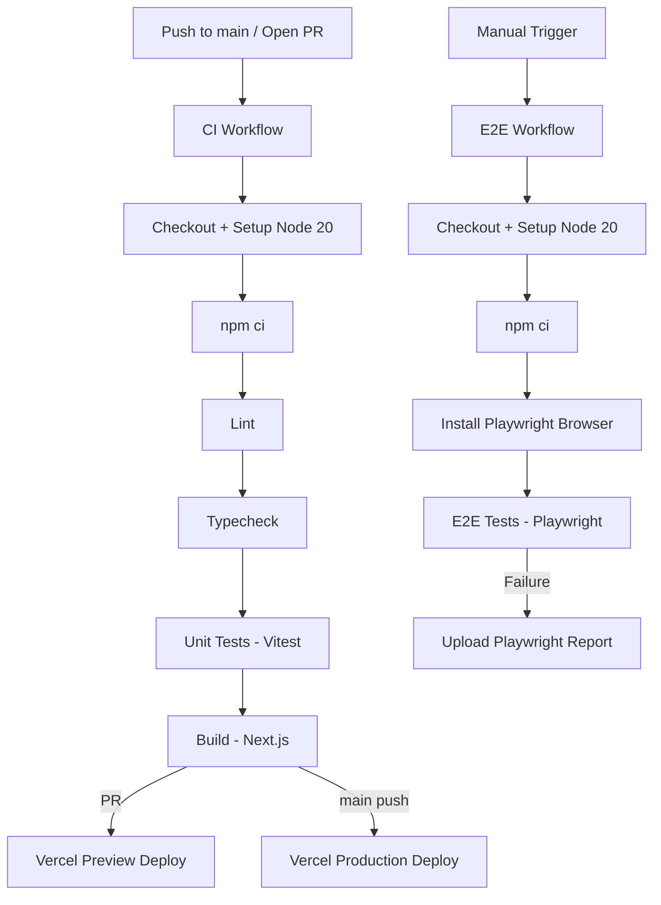

# CI/CD Pipeline — Mentes Sinteticas

## Pipeline Flow



## Workflows

### CI (`ci.yml`) — Automatic

Runs on every push to `main` and every PR targeting `main`.

| Step | Command | Purpose |
|------|---------|---------|
| Lint | `npm run lint` | ESLint code quality |
| Typecheck | `npx tsc --noEmit` | TypeScript validation |
| Test | `npm run test` | 186 Vitest unit tests |
| Build | `npm run build` | Next.js production build |

### E2E (`e2e.yml`) — Manual

Triggered manually via GitHub Actions UI (`workflow_dispatch`). Supports browser selection (chromium, firefox, webkit). Timeout: 30 minutes.

| Step | Command | Purpose |
|------|---------|---------|
| Install browser | `npx playwright install --with-deps <browser>` | Browser binaries |
| Run E2E | `npm run test:e2e -- --project=<browser>` | 15 Playwright specs |
| Upload report | `actions/upload-artifact@v4` | On failure, 14-day retention |

## GitHub Secrets

| Secret | Purpose | Used By |
|--------|---------|---------|
| `NEXT_PUBLIC_SUPABASE_URL` | Supabase project URL | CI (build), E2E |
| `NEXT_PUBLIC_SUPABASE_ANON_KEY` | Supabase anonymous key | CI (build), E2E |
| `E2E_TEST_EMAIL` | Test user email for auth flows | E2E only |
| `E2E_TEST_PASSWORD` | Test user password for auth flows | E2E only |

**How to add:** Repository Settings > Secrets and variables > Actions > New repository secret.

## Vercel Environment Variables

Set these in the Vercel Dashboard (Settings > Environment Variables):

| Variable | Environment | Purpose |
|----------|-------------|---------|
| `NEXT_PUBLIC_SUPABASE_URL` | All | Supabase project URL |
| `NEXT_PUBLIC_SUPABASE_ANON_KEY` | All | Supabase anonymous key |
| `SUPABASE_SERVICE_ROLE_KEY` | Production, Preview | Server-side Supabase access |
| `GOOGLE_GENERATIVE_AI_API_KEY` | Production, Preview | Gemini API for AI chat |

## Branch Protection Rules

Configure in Repository Settings > Branches > Add rule for `main`:

| Rule | Setting | Rationale |
|------|---------|-----------|
| Require status checks | Enable, select `ci` job | No merge without passing CI |
| Require branches to be up to date | Enable | Prevent merge conflicts |
| Require PR reviews | 1 reviewer minimum | Code quality gate |
| Restrict direct pushes | Enable | All changes via PR |
| Include administrators | Enable | No bypassing rules |

## Running E2E Tests Manually

1. Go to the repository on GitHub
2. Navigate to **Actions** tab
3. Select **E2E Tests** workflow in the left sidebar
4. Click **Run workflow** button
5. Select the branch and browser (chromium/firefox/webkit)
6. Click **Run workflow**

Results appear in the workflow run. If tests fail, download the Playwright report from the **Artifacts** section.

## Troubleshooting

### CI: Lint fails

```
Error: ESLint found problems
```

Fix locally: `npm run lint -- --fix`, then commit.

### CI: Typecheck fails

```
error TS2345: Argument of type...
```

Fix locally: `npx tsc --noEmit` to see all errors, fix type issues, then commit.

### CI: Build fails with missing env vars

```
Error: Missing NEXT_PUBLIC_SUPABASE_URL
```

Ensure `NEXT_PUBLIC_SUPABASE_URL` and `NEXT_PUBLIC_SUPABASE_ANON_KEY` are set in GitHub Secrets (see table above).

### E2E: Tests timeout

- Default timeout is 30 minutes for the entire job
- Individual test timeouts are configured in `playwright.config.ts`
- Check if the app starts correctly — Playwright expects `npm run dev` or `npm run start`

### E2E: Auth tests fail

- Verify `E2E_TEST_EMAIL` and `E2E_TEST_PASSWORD` secrets are set
- Ensure the test user exists in the Supabase project
- Check that the Supabase URL/key secrets point to the correct environment

### E2E: Browser install fails

```
Error: Failed to download chromium
```

This usually resolves on retry. If persistent, check GitHub Actions runner disk space or try a different browser.

### Vercel: Preview deploy fails

- Check Vercel Dashboard > Deployments for build logs
- Ensure all environment variables are set for the Preview environment
- Verify `package.json` build script works locally: `npm run build`
